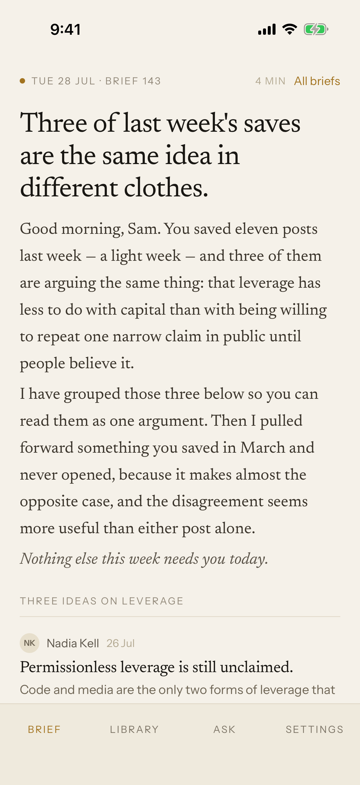
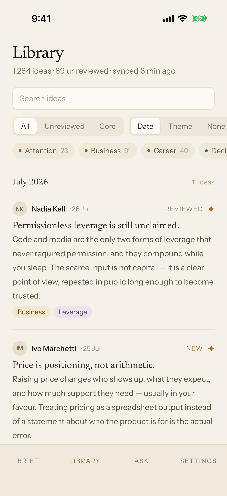
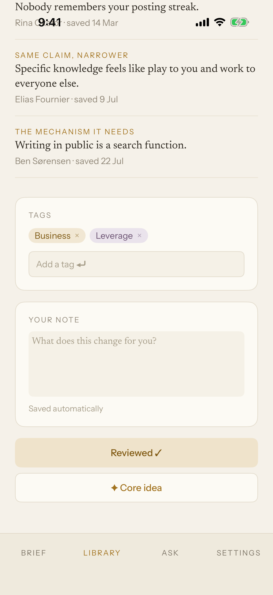
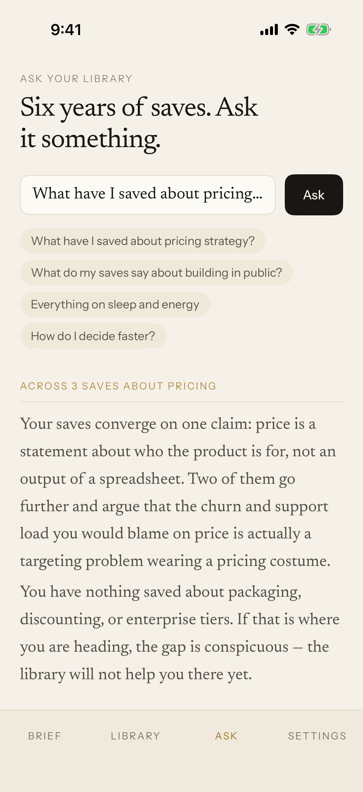

# Commonplace

**Your bookmarks are a library nobody ever catalogued.**

Commonplace reads everything you save on X, extracts the *idea* inside each post,
and returns the right ones to you each morning as a written brief. The thesis is
**ideas, not archives**: people save high-signal posts and never revisit them, so
the product's job is retrieval, not storage.

Two implementations of the same design live here.

| | | |
|---|---|---|
| [`web/`](web) | **Next.js 16, React 19, Tailwind v4** | The real one. Connects an X account, summarises, sends briefs. Deploys to Vercel. |
| [`ios/`](ios) | **SwiftUI, iOS 17+** | A portfolio build. No backend, bundled data, made to be screenshotted and screen-recorded. |

<p align="center">
  
  
  
  
</p>

## The six surfaces

| Surface | What it does |
|---|---|
| **Daily brief** | The home screen. A prose note that groups 2–3 of the week's saves into one argument, resurfaces an older forgotten save, and asks one recall question. |
| **Past briefs** | Archive of previous briefs, with read state. |
| **Library** | The full corpus, scannable — grouped by date or theme, filterable, keyboard-navigable. |
| **Idea detail** | Summary, key concepts, actionable takeaways, the original post, and three semantic **Connections** each labelled with its reasoning. |
| **Ask your library** | A natural-language question answered only from what you saved, with cited sources. |
| **Settings** | Delivery time, frequency, channels, connected account, export. |

## Running them

```bash
# Web — http://localhost:3000
cd web && npm install && npm run dev

# iOS — needs Xcode 16+ and xcodegen (brew install xcodegen)
cd ios && xcodegen generate && open Commonplace.xcodeproj
```

Per-app detail lives in [`web/README.md`](web/README.md) and
[`ios/README.md`](ios/README.md). Read those before changing either app — each
has a "things that will bite you" section, and they are not the same list.

## The design rules

These are load-bearing. Breaking one is what makes this stop looking like itself.

- **Two typefaces only.** Newsreader (serif) for anything editorial — headlines,
  brief prose, idea titles, summaries. Instrument Sans for UI — nav, labels,
  buttons, metadata. Never a third.
- **Warm paper, never grey.** Ground `#F5F1E9`, ink `#191713`. Every neutral
  carries a yellow-brown cast. No pure white, no pure black, no cool greys.
- **One accent.** Ochre `#A2731F`, marking unread, focus, links and the primary
  action. Semantic tag colours are the only other hues.
- **No emoji, no gradients, no decorative illustration.** The visual interest
  comes from typography and hairlines.
- **Prose over dashboards.** The brief is a note from a person, in full
  sentences. Never cards, bullets, stat tiles or a KPI row.
- **Hairlines, not borders.** Rows separate with 1px `#EAE3D4`. Cards use
  `#FCFAF4` on a 1px `#E4DDCE`. The only shadows are the segmented-control pill
  and the toast.

The copy voice matters as much as the palette: a careful research assistant,
British spelling, no exclamation marks, comfortable saying there is nothing worth
reading today. *"Nothing else this week needs you today."* — not *"You're all
caught up! 🎉"*.

## The one thing that surprises people

**The two apps report numbers differently, on purpose.**

The web app shows **real counts** derived from the corpus — 12 ideas, 8
unreviewed. The iOS app shows **fixed display constants** — 1,284 ideas, 142
briefs, 89 unreviewed — because a portfolio build has to look like a product in
real use, not a demo with twelve rows in it.

So a hard-coded total is a bug in `web/` and correct in `ios/`. Both READMEs say
so at the top of their gotchas.

## Content and the design bundle

The 12 bookmarks, 6 briefs, connection graph and Ask answers are **written
content, not filler**. They are generated into both apps from a single source by
the scripts in [`tools/`](tools):

```bash
node tools/extract-web-seed.mjs   # → web/src/lib/seed.ts
node tools/extract-ios-seed.mjs   # → ios/Commonplace/Resources/Seed.json
node tools/check-content.mjs      # verifies both, needs no bundle
```

`check-content.mjs` is the interesting one. It asserts the content rules — that a
brief labelled "Two decision rules" really has two items, that every
cross-reference resolves, that no connection is labelled the useless "Related"
(*"Argues the opposite"* is the feature) — and that **the web and iOS seeds are
byte-identical**. Keeping both platforms provably in sync is the reason these
apps share a repository.

> **Note.** The design specification and the HTML prototype the seed is extracted
> from are the brief this was built against and are **not included here**. The
> generated seed files are committed, so both apps build from a clean clone; you
> only need the bundle to re-run the two extract scripts.

## Licence

Code is [MIT](LICENSE). The bundled Newsreader and Instrument Sans fonts are SIL
OFL 1.1, with their licences in `ios/Commonplace/Design/Fonts/`. The design
itself is not covered — see [LICENSE](LICENSE).
